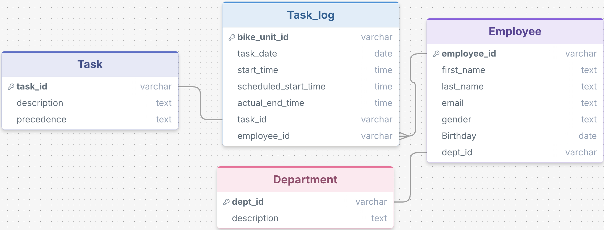

# VeloForge Operations Analyst — Snowflake Intelligence Platform

A two-product analytics platform built on Snowflake that gives VeloForge bicycle assembly managers instant, data-backed answers about their production floor, through a self-service chat app and a Slack-native AI agent.

---

## The Company

**VeloForge** is a bicycle manufacturer that assembles bikes across six specialized departments. Each bike moves through a 14-step sequential assembly line, from frame construction to final packaging and with every task logged in real time. Operations managers need fast visibility into throughput, delays, and workforce performance without writing SQL or switching tools.

---

## The Two Products

### Product 1 — Streamlit in Snowflake App
A self-service chat interface deployed on Snowflake. Managers open it through the shared URL and ask questions about the assembly data in plain English. Cortex Analyst translates the question into SQL, executes it, and Cortex Complete narrates the results as a concise answer.

### Product 2 — OpsBike AI Slack Agent
A conversational operations analyst agent deployed on Slack via Snowflake MCP (Model Context Protocol). Production managers and supervisors ask questions directly in Slack and get data-backed answers without leaving the tools they already use. The agent goes beyond simple Q&A — it monitors thresholds, surfaces performance alerts, provides performance steering actions and generates 30-day forecasts.

---

## Technology Stack

| Layer | Technology |
|---|---|
| Data Warehouse | Snowflake |
| Natural Language to SQL | Snowflake Cortex Analyst |
| Semantic Layer | Snowflake Semantic Model (YAML) |
| LLM for Answer Generation | Snowflake Cortex Complete (`SNOWFLAKE.CORTEX.COMPLETE`) |
| Entity Resolution | Snowflake Cortex Search |
| Statistical Forecasting | Snowflake ML.FORECAST |
| Self-Service App | Streamlit in Snowflake (SiS) |
| Slack Integration | Snowflake MCP (Model Context Protocol) |

### Snowflake Cortex Analyst
Translates natural language questions into SQL using the semantic model as schema context. Understands business terminology like "schedule variance", "on-time rate", and "cycle time" — generating accurate queries without the user needing to know the underlying tables.

### Semantic Model
`semantic_model.yaml` defines the business meaning of tables, columns, metrics, and relationships. It exposes pre-calculated measures like `ON_TIME_RATE`, `BIKE_CYCLE_TIME`, and `AVG_DELAY_LATE_ONLY` so Cortex Analyst answers operational questions accurately and consistently.

### Snowflake MCP
Connects the OpsBike AI agent to Slack. Users interact with the agent in natural language inside Slack channels or DMs. The agent calls Cortex Analyst, Cortex Search, Cortex Complete, and ML.FORECAST as tools depending on the question type.

---

## Entity Relationship Diagram



---

## Product 1: Streamlit Chat App

The Streamlit in Snowflake app (`bike_operations_analyst_app`) provides a browser-based chat interface for self-service analytics.

**How it works:**
1. User types a question in the chat input
2. The question is sent to Cortex Analyst, which uses the semantic model to generate SQL
3. The SQL is executed against the Snowflake tables
4. Results are passed to `SNOWFLAKE.CORTEX.COMPLETE`, which narrates a concise answer
5. The answer, generated SQL, and raw results are all surfaced in the UI
6. Full conversation history is maintained so follow-up questions work in context

**Sample questions for the Streamlit app:**
- How many bikes did we complete last month?
- Which task has the worst on-time rate?
- What is the average task duration for Frame Assembly?
- Which department has the highest schedule variance?
- Who are the top 5 employees by tasks completed?

---

## Product 2: OpsBike AI Slack Agent

**OpsBike AI** is a Slack-native operations analyst agent deployed via Snowflake MCP. It covers 10 core responsibilities across three categories:

| Category | Responsibilities |
|---|---|
| **Descriptive** (what happened) | R1–R8: production, schedule, tasks, employees, departments, workforce, trends, process |
| **Prescriptive** (what to do) | R9: performance steering — threshold monitoring with tiered alerts |
| **Predictive** (what will happen) | R10: 30-day statistical forecasting via ML.FORECAST |

### Agent Tools

| Tool | Function | Used By |
|---|---|---|
| Cortex Analyst | Translates questions to SQL and executes them | R1–R9 |
| Cortex Complete | Generates natural language answers from SQL results | R1–R10 |
| Cortex Search | Resolves fuzzy names ("the handlebar task", "Eyde") to exact IDs before querying | R3, R4, R6, R8, R9 |
| ML.FORECAST | Generates 30-day time-series forecasts with confidence intervals | R10 only |

### Agent Responsibilities (R1–R10)

#### R1 — Production & Throughput Reporting
Answers questions about how many bikes are produced and how fast the line runs. Tracks daily, weekly, and monthly bike output (bikes that reach T14 count as complete), average bike cycle time from T1 start to T14 end, and total tasks logged in any period.

*Example questions: "How many bikes did we complete in March?" / "Which week had the highest output this year?" / "Show me the monthly production trend for 2023"*

#### R2 — Schedule Adherence Analysis
Reports whether tasks are finishing on time against their scheduled end times. Covers on-time completion rate (overall and per task), average delay when late, maximum overrun per task type, and schedule variance trends over time.

*Example questions: "What's our overall on-time rate?" / "Which task runs late most often?" / "Is our on-time rate improving month over month?"*

#### R3 — Task Performance Analysis
Analyses how long each of the 14 assembly tasks takes, how consistent they are, and how actual durations compare to defined baselines. Surfaces average duration, standard deviation, and maximum duration per task type.

*Example questions: "What's the average duration for Frame Assembly?" / "Which task has the most inconsistent duration?" / "Rank all tasks by average duration"*

#### R4 — Employee Performance Analysis
Evaluates individual employee productivity, speed, and schedule adherence. Covers tasks completed per day, average task duration, on-time rate, utilization rate (active minutes vs 540-minute shift), and bikes handled per employee.

*Example questions: "Who are the top 10 fastest employees in the Frame department?" / "Show me employees with on-time rates below 80%" / "What's the utilization rate for employee 528-15826?"*

#### R5 — Department Efficiency Analysis
Rolls up performance metrics to the department level for management reporting. Covers department on-time rate, average task duration, daily throughput, and utilization — identifying which departments are bottlenecks.

*Example questions: "Which department has the worst on-time rate?" / "Compare throughput across all departments" / "Which department is the bottleneck?"*

#### R6 — Workforce Profiling
Answers questions about the composition and demographics of the 980-person workforce. Covers headcount by department, gender distribution, employee age (derived from birthday), and average age by department.

*Example questions: "How many employees are in each department?" / "What's the gender split in the Drivetrain team?" / "Which department has the oldest workforce on average?"*

#### R7 — Time Trend & Pattern Analysis
Identifies temporal patterns in production data. Covers weekly output trends, day-of-week throughput patterns, monthly on-time rate trends, and quarterly comparisons.

*Example questions: "Are Mondays slower than Fridays?" / "How did Q3 compare to Q1 in output?" / "Which month had the best cycle time?"*

#### R8 — Process & Precedence Queries
Explains the assembly process, task dependencies, and department responsibilities. Reads and interprets the `TASK.precedence` column in plain language rather than parsing it programmatically.

*Example questions: "What tasks need to be done before Quality Check?" / "Which tasks can run in parallel?" / "What does the Drivetrain department do?"*

#### R9 — Performance Steering Recommendations
Monitors five operational thresholds against live data and surfaces tiered alerts with data-backed recommendations. See the full breakdown below.

#### R10 — Production Output Forecasting
Generates 30-day statistical forecasts using `SNOWFLAKE.ML.FORECAST` for daily bike output, weekly on-time rate, task duration trends, and department throughput. All forecasts include confidence intervals and are clearly labelled as estimates, not facts.

*Example questions: "How many bikes are we likely to produce next month?" / "Will our on-time rate improve or decline over the next 30 days?" / "Forecast Drivetrain throughput for the next 4 weeks"*

---

### Performance Steering (R9)

When a manager asks for a health check — or flags a potential issue — the agent runs five threshold SQL queries simultaneously against the live data. Cortex Complete then reasons over all five result sets together and composes a single tiered response: **Critical**, **Warning**, or **Healthy** for each area.

**The five thresholds monitored:**

| # | Level | Metric | Trigger condition |
|---|---|---|---|
| T-1 | Task | On-time completion rate | Falls below 90% (trailing 7 days) |
| T-2 | Task | Average duration vs baseline | Exceeds 120% of its defined baseline (trailing 7 days) |
| T-3 | Employee | Utilization rate | Below 60% of the 540-minute shift (prior business day) |
| T-4 | Department | Weekly throughput | Drops more than 15% vs the prior week |
| T-5 | Production | Daily bike output | Falls below the 25-bike daily target (trailing 7 days) |

**How the agent generates recommendations:**

1. Cortex Analyst runs all five threshold queries in parallel and returns five result sets
2. Cortex Complete reads every result set together and classifies each finding as Critical (significant breach), Warning (mild breach or approaching threshold), or Healthy (within limits)
3. For every flagged item, the agent cites the exact metric value and threshold that triggered it, then surfaces a specific, data-backed suggestion using measured language ("consider", "worth reviewing", "may indicate") — never directives
4. Items that are within healthy limits are listed explicitly so managers know what is not a concern

**Example alert output:**

```
PERFORMANCE ALERT — [date]

CRITICAL:
  T8 (Gear Shifter Adjustment) — on-time rate 76% [threshold: 90%]
  → Review Drivetrain employees assigned to T8 this week.
    Consider pairing lower performers with higher-performing peers next shift.

WARNING:
  Daily output — 22 bikes on Tuesday [baseline: 25]
  → Check whether T1 (Frame Assembly) was understaffed.
    Tuesday had fewer FRM employees active than the weekly average.

HEALTHY:
  T1, T2, T3, T4, T5, T6, T7, T9, T10, T11, T12, T13, T14 — all clear.
```

**Guardrails applied to every recommendation:**
- Always cites the metric value and threshold that triggered the alert
- Never recommends actions based on personal employee data beyond task performance
- Never presents a recommendation as a directive — always as a suggestion
- If all thresholds are healthy, says so clearly rather than inventing concerns

### Forecasting (R10)
Generates 30-day projections for daily bike output, weekly on-time rate, task duration trends, and department throughput. All forecasts include confidence intervals and are clearly labelled as estimates.

### Sample questions for the Slack agent:
- Are there any performance issues I should know about this week?
- Which department is the bottleneck right now?
- Who are the slowest employees in the Drivetrain team?
- How many bikes are we likely to produce next month?
- Is our on-time rate improving or getting worse over the year?
- Flag anything underperforming — give me a full health check
- What tasks can run in parallel during assembly?
- Which employees have on-time rates below 80%?
- Forecast Drivetrain department throughput for the next 4 weeks
- How did Q3 compare to Q1 in output?

---

## Setup

### 1. Snowflake Data Layer
Run `DDL.sql` to create the database, schema, tables, and stage:
```sql
-- Creates SNOWFLAKE_OPERATIONS_ANALYST database, ANALYTICS schema,
-- DEPARTMENT, EMPLOYEE, TASK, TASK_LOG tables, and csv_stage
```

Upload CSV files from the `data/` folder to the internal stage, then load:
```sql
COPY INTO DEPARTMENT FROM @csv_stage/department.csv;
COPY INTO EMPLOYEE FROM @csv_stage/employee.csv;
COPY INTO TASK FROM @csv_stage/task.csv;
COPY INTO TASK_LOG FROM @csv_stage/task_log.csv;
```

### 2. Semantic Model
Create a Snowflake Semantic View using `semantic_model.yaml` in the `ANALYTICS` schema.

### 3. Streamlit App
Deploy `bike_operations_analyst_app` as a Streamlit in Snowflake app:
- In Snowsight: **Projects → Streamlit → + Streamlit App**
- Set database/schema to `SNOWFLAKE_OPERATIONS_ANALYST.ANALYTICS`
- Paste the app code and click **Run**

### 4. Forecasting Views (required for R10)
Create the four ML.FORECAST input views defined in `Agent_instructions/agent_design_document.md` (`V_DAILY_BIKE_OUTPUT`, `V_WEEKLY_ONTIME_RATE`, `V_TASK_DURATION_DAILY`, `V_DEPT_DAILY_THROUGHPUT`).

### 5. Slack Agent
Configure the OpsBike AI agent in Snowflake Intelligence using the persona and tool definitions in `Agent_instructions/agent_design_document.md`, then connect to Slack via the Snowflake MCP integration.
